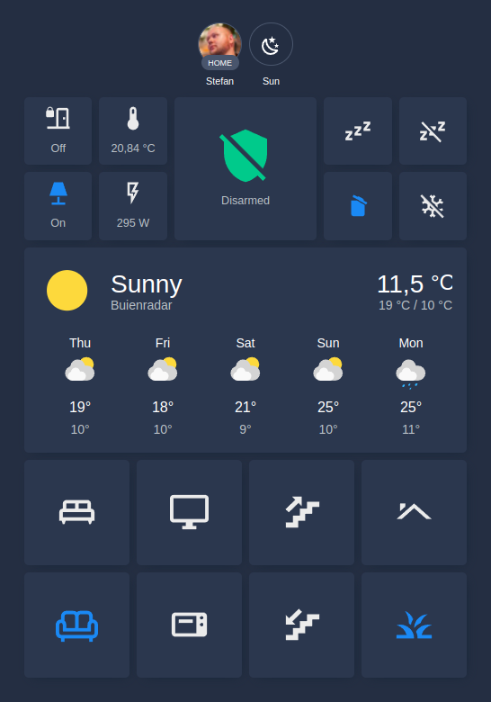

# Home Assistant config

 

## About

This repository contains the complete configuration for my Home Assistant instance:
* Infrastructure setup based on Docker Compose
* The dashboard configuration, in YAML format
* Home assistant configuration files, in YAML format

## Environment setup

Home Assistant is most commonly seen as a Raspberry Pi installation called Hass.io, but since I already had a NAS I
could simply run HA on there. My NAS is set up to run multiple projects simultaneously using Docker Compose and Traefik,
that's why you find a `docker-compose.yml` file in this project. The labels on the various services in that file are
there to make Traefik know what to do (mainly show the right container for the right host and manage TLS certificates).
This means my HA installation is accessible from the web via HTTPS on a public URL.

## Dashboard setup

The dashboard I created uses the [Noctis](https://github.com/aFFekopp/noctis) theme and is heavily inspired by
[this](https://www.youtube.com/watch?v=5y6rhwr5Y8c) YouTube video. The main benefit for such a dashboard is that it
works really well on my mobile phone, which is the main way I interact with Home Assistant.

    

## Plugins

My setup has various plugins, which are managed by [HACS](https://hacs.xyz/) aka the Home Assistant Community Store.

### Integrations
* [Afvalwijzer](https://github.com/xirixiz/homeassistant-afvalwijzer)
* [Daikin Residential Controller](https://github.com/rospogrigio/daikin_residential)
* [HACS](https://github.com/hacs/integration)

### Frontend
* [auto-entities](https://github.com/thomasloven/lovelace-auto-entities)
* [apexcharts-card](https://github.com/RomRider/apexcharts-card)
* [card-mod](https://github.com/thomasloven/lovelace-card-mod)
* [Noctis](https://github.com/aFFekopp/noctis)
* [Noctis Grey](https://github.com/chaptergy/noctis-grey)
* [Simple Thermostat](https://github.com/nervetattoo/simple-thermostat)

## Connected devices

Currently my Home Assistant setup is managing the following devices:

| Qty | Type               | Make & Model                                                                                                                                                                            | Integration                                                                                                           |
|-----|--------------------|-----------------------------------------------------------------------------------------------------------------------------------------------------------------------------------------|-----------------------------------------------------------------------------------------------------------------------|
| 2   | AC unit            | [Daikin Perfera FTXM-R](https://www.daikin.eu/en_us/products/ftxm-r.html)                                                                                                               | [Daikin Residential Controller](https://github.com/rospogrigio/daikin_residential/)                                   |
| 1   | Steam oven         | [Siemens IQ700 CS858GRB7](https://www.siemens-home.bsh-group.com/nl/productoverzicht/koken-en-bakken/bakovens/bakovens-met-sous-vide-functie/CS858GRB7)                                 | [Home Connect](https://www.home-assistant.io/integrations/home_connect)                                               |
| 1   | Microwave combi    | [Siemens IQ700 CM836GNB6](https://www.siemens-home.bsh-group.com/nl/productoverzicht/koken-en-bakken/bakovens/bakovens-met-magnetron/CM836GNB6)                                         | [Home Connect](https://www.home-assistant.io/integrations/home_connect)                                               |
| 1   | Coffee machine     | [Siemens IQ700 CT836LEB6](https://www.siemens-home.bsh-group.com/nl/productoverzicht/koffie/inbouw-espresso-volautomaten/CT836LEB6)                                                     | [Home Connect](https://www.home-assistant.io/integrations/home_connect)                                               |
| 1   | Cooktop            | [Siemens IQ700 EX807LVV5E](https://www.siemens-home.bsh-group.com/nl/productoverzicht/koken-en-bakken/kookplaten/inductiekookplaten/EX807LVV5E)                                         | [Home Connect](https://www.home-assistant.io/integrations/home_connect)                                               |
| 1   | Dish washer        | [Siemens IQ300 SX63H800UE](https://www.siemens-home.bsh-group.com/nl/productoverzicht/vaatwassers/vaatwassers-ingebouwd/vaatwassers-volledige-grootte/volledig-geintegreerd/SX63H800UE) | [Home Connect](https://www.home-assistant.io/integrations/home_connect)                                               |
| 1   | DSMR smart meter   | [HomeWizard P1 meter](https://www.homewizard.nl/homewizard-wi-fi-p1-meter)                                                                                                              | [HomeWizard Energy](https://www.home-assistant.io/integrations/homewizard)                                            |
| 1   | TV                 | [LG OLED55CX6LA](https://www.lg.com/uk/tvs/lg-oled55cx6la)                                                                                                                              | [LG webOS Smart TV](https://www.home-assistant.io/integrations/webostv)                                               |
| 1   | Mobile phone       | [OnePlus 7T Pro](https://www.oneplus.com/uk/7t-pro)                                                                                                                                     | [Home Assistant App](https://play.google.com/store/apps/details?id=io.homeassistant.companion.android)                |
| 1   | Z-Wave stick       | [Aeotec Z-Stick Gen 5](https://aeotec.com/z-wave-usb-stick/index.html)                                                                                                                  | [MQTT](https://www.home-assistant.io/integrations/mqtt/) via [zwavejs2mqtt](https://github.com/zwave-js/zwavejs2mqtt) |
| 6   | Wall Plug switch   | [TBKHome On/Off module TZ68](http://www.tkbhome.com/Z-WAVE-EU-Type-Plug-in-ON-OFF-Socket_012_61.html)                                                                                   | [MQTT](https://www.home-assistant.io/integrations/mqtt/) via [zwavejs2mqtt](https://github.com/zwave-js/zwavejs2mqtt) |
| 2   | Wall Plug switch   | [ROBB Smarrt Slimme Stekker SR-ZV9021A](https://www.robbshop.nl/robb-smarrt-slimme-stekker-z-wave-3680watt)                                                                             | [MQTT](https://www.home-assistant.io/integrations/mqtt/) via [zwavejs2mqtt](https://github.com/zwave-js/zwavejs2mqtt) |
| 1   | Rain sensor        | [Popp Z-Rain 700168](https://popp.eu/products/z-rain/)                                                                                                                                  | [MQTT](https://www.home-assistant.io/integrations/mqtt/) via [zwavejs2mqtt](https://github.com/zwave-js/zwavejs2mqtt) |
| 2   | Relay switch       | [Qubino Flush 2 Relays ZMNHBD](https://qubino.com/products/flush-2-relays/)                                                                                                             | [MQTT](https://www.home-assistant.io/integrations/mqtt/) via [zwavejs2mqtt](https://github.com/zwave-js/zwavejs2mqtt) |
| 1   | Shutter            | [Qubino Flush Shutter ZMNHCD](https://qubino.com/products/flush-shutter/)                                                                                                               | [MQTT](https://www.home-assistant.io/integrations/mqtt/) via [zwavejs2mqtt](https://github.com/zwave-js/zwavejs2mqtt) |
| 4   | Dimmer             | [EcoDim ECO-DIM.07 Zwave Basic](https://www.ecodim.nl/nl/eco-dim07-zwave.html)                                                                                                                            | [MQTT](https://www.home-assistant.io/integrations/mqtt/) via [zwavejs2mqtt](https://github.com/zwave-js/zwavejs2mqtt) |
| 11  | Door/window sensor | [Neo Coolcam DS01Z](https://www.robbshop.nl/neo-coolcam-raam-deur-sensor-z-wave-plus)                                                                                                   | [MQTT](https://www.home-assistant.io/integrations/mqtt/) via [zwavejs2mqtt](https://github.com/zwave-js/zwavejs2mqtt) |
| 1   | Doorbell           | [Aeotec Doorbell 6](https://aeotec.com/z-wave-doorbell/)                                                                                                                                | [MQTT](https://www.home-assistant.io/integrations/mqtt/) via [zwavejs2mqtt](https://github.com/zwave-js/zwavejs2mqtt) |
| 1   | Thermostat control | [OpenTherm gateway v2.4](https://www.nodo-shop.nl/nl/ons-assortiment/211-opentherm-gateway.html)                                                                                        | [MQTT](https://www.home-assistant.io/integrations/mqtt/)                                                              |
